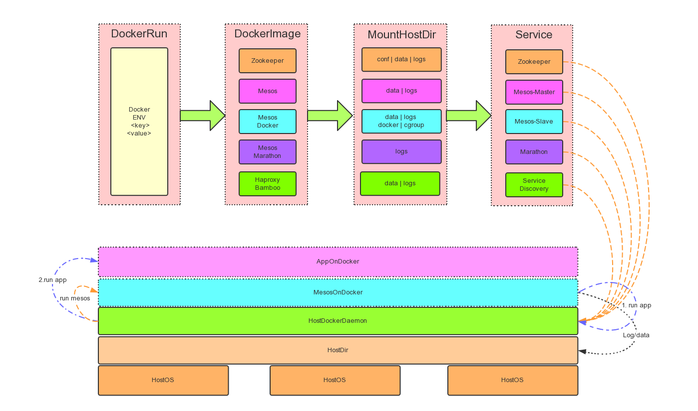

# Mesos On Docker 环境部署

    文档信息
    创建人 庞铮
    邮件地址 zpang@dataman-inc.com
    建立时间 2015年7月27号
    更新时间 2015年7月29号
# 1 想法
## 1.1 基础
如果对 Mesos 和 Docker 系统有兴趣但还没有了解，请先阅读参考文档
     
Mesos:[数人科技Mini(单机版)-Mesos系统安装-Ubuntu](http://doc.dataman-inc.com/diy/single-node.html)

Docker:[Docker-从入门到实践](http://yeasy.gitbooks.io/docker_practice/content/)
## 1.2 启发 
在完成了[数人科技Mini(单机版)-Mesos系统安装-Ubuntu](http://doc.dataman-inc.com/diy/single-node.html)文档后，原本打算在完成一篇相对应的 CentOS 版本的安装文档，但经过和同事讨论后发现，既然是 Docker 集群管理软件，Docker 本身的优势和特性否可以用在安装 Mesos 集群呢？这样只要能安装 Docker 的服务就可以运行 Mesos ，一劳永逸的解决 OS 层面的环境问题。
## 1.3 需要解决的问题列表
* Docker 化所有 Mesos 系统组件服务
   
  Docker系统本来就解决了这个问题。
  
* Mesos 系统组件服务参数动态配置

  Mesos 系统本身大部分都支持系统传参，只有部分需要稍加改造即可。

* Mesos 系统组件服务持久化问题,包括数据和日志

  持久化问题分2个方向:数据持久化、日志持久化
  - 数据持久化
    
    数据持久化现有 Docker 的解决办法无外乎通过 -v 参数将本地磁盘或者远程磁盘映射到 Docker 内部。
  - 日志持久化
    
    日志持久化现阶段有3种解决方案，容器内收集、容器外收集、容器内 Agent 收集，本方案为了简单，选择了容器外部收集。
  
* Docker 中的 Docker 软件管理宿主机系统的 Docker 服务启动 App。(好像有点绕口)
  
  Mesos 系统内部管理的调度服务启动的 Docker 需要使用宿主机资源，而调度不是Docker化Mesos-Slave的资源。

# 2 MesosOnDokcer部署说明
## 2.1 部署架构图

## 2.2 架构图说明
架构图分两部分：Docker Run Mesos 和 Meos On Docker 工作层级

- Mesos On Docker 
  
  和大多数 Docker App 一样，Mesos On Docker 通过3个步骤完成服务启动。
  
  * 传参到 Docker 内部应用
  * 指定镜像
  * 挂载宿主目录
  * 提供服务   
  
- Meos On Docker 工作层级
  - Docker 化后的 Mesos 系统通过传参将 Mesos 系统运行在宿主机的 Docker 中，数据和日志的目录通过 -v 参数挂载到了 Docker 系统中，已帮助 Docker 化的服务记录持久化数据。
  - 真正提供生产服务器的 Docker App 通过 Mesos系统发布到了集群中的宿主机 Docker 中。 

# 3 安装部署
## 3.1 生成 Mesos 系统 Docker 镜像。
### 3.1.1 说明
本身 Docker 通过从命令中的启动参数和传输系统变量来控制内部服务启动模式。对应特殊需求，有时必须对程序初始化方法进行改造以对应需求的新启动脚本。

创建 Docker 镜像方法

- 生成应用的 Dockerfile 目录
- 生成修改启动脚本和 Dockerfile 文件
- 编译 Docker 镜像

### 3.1.2 宿主机安装Docker
    
    sudo wget -qO- https://get.docker.com/ | sh

### 3.1.3 Zookeeper
生成目录

    mkdir -p /data/docker/zookeeper 
zkEnv.sh(启动脚本取变量值关联脚本，注释写死的变量参数,这样可以从)

    vi /data/docker/zookeeper/zkEnv.sh
    
    NAME=zookeeper
    #ZOOCFGDIR=/etc/$NAME/conf
    CLASSPATH="$ZOOCFGDIR:/usr/share/java/jline.jar:/usr/share/java/log4j-1.2.jar:/usr/share/java/xercesImpl.jar:/usr/share/java/xmlParserAPIs.jar:/usr/share/java/netty.jar:/usr/share/java/slf4j-api.jar:/usr/share/java/slf4j-log4j12.jar:/usr/share/java/zookeeper.jar"

    ZOOCFG="$ZOOCFGDIR/zoo.cfg"
    USER=$NAME
    GROUP=$NAME
    PIDDIR=/var/run/$NAME
    PIDFILE=$PIDDIR/$NAME.pid
    SCRIPTNAME=/etc/init.d/$NAME
    JAVA=/usr/bin/java
    ZOOMAIN="org.apache.zookeeper.server.quorum.QuorumPeerMain"
    JMXLOCALONLY=false

Dockerfile
    
    vi /data/docker/zookeeper/Dockerfile
    
    FROM ubuntu:14.04
    MAINTAINER pangzheng zpang@dataman-inc.com

    #install wget
    RUN apt-get install -y wget

    #install zookeeper
    RUN apt-key adv --keyserver keyserver.ubuntu.com --recv E56151BF  && DISTRO=$(lsb_release -is | tr     '[:upper:]' '[:lower:]')  && CODENAME=$(lsb_release -cs) && echo "deb http://repos.mesosphere.io/${DISTRO} ${CODENAME} main" > /etc/apt/sources.list.d/mesosphere.list && apt-get update && apt-get -y install zookeeper zookeeper-bin zookeeperd

    #install curl
    RUN apt-get install -y curl

    #env
    COPY zkEnv.sh /usr/share/zookeeper/bin/zkEnv.sh

    CMD ["/usr/share/zookeeper/bin/zkServer.sh","start-foreground"]
生成镜像
    
    docker build -t mesos/zookeeper /data/docker/zookeeper/
### 3.1.4 Mesos
Mesos 镜像分三个 Mesos-base \ Mesos-master \ Mesos-slave,Mesos 的 Master 和 Slave 以及调度框架程序 Marathon 都需要 Mesos 安装，所以在这里将 Mesos 安装单独抽象出来制作了独立的 Mesos/base。

#### 3.1.4.1 Mesos-base
生成目录

    mkdir -p /data/docker/mesos-base 
Dockerfile

    vi /data/docker/mesos-base/Dockerfile    
    
    FROM ubuntu:14.04
    MAINTAINER pangzheng zpang@dataman-inc.com

    #install wget
    RUN apt-get install -y wget

    #install dataman mesos
    RUN wget -O - http://get.dataman.io/repos/ubuntu/key | apt-key add - && sudo echo "deb http://get.dataman.io/repos/ubuntu ./" > /etc/apt/sources.list.d/dataman.list &&  apt-get update && sudo apt-get -y install mesos

    #install docker
    RUN wget -qO- https://get.docker.com/ | sh

    #install curl
    RUN apt-get install -y curl
生成镜像

    docker build -t mesos/base /data/docker/mesos-base/
#### 3.1.4.2 Mesos-master
生成目录

    mkdir -p /data/docker/mesos-master 
Dockerfile
    
    vi /data/docker/mesos-master/Dockerfile
    
    FROM mesos/base
    MAINTAINER pangzheng zpang@dataman-inc.com

    CMD ["/usr/sbin/mesos-master"]
生成镜像

    docker build -t mesos/master /data/docker/mesos-master/
####  3.1.4.3 Mesos-slave
生成目录

    mkdir -p /data/docker/mesos-slave
Dockerfile

    vi /data/docker/mesos-slave/Dockerfile

    FROM mesos/base
    MAINTAINER pangzheng zpang@dataman-inc.com

    CMD ["/usr/sbin/mesos-slave"]
Mesos-slave 生成镜像

    docker build -t mesos/slave /data/docker/mesos-slave/
### 3.1.5 Marathon
生成目录

    mkdir -p /data/docker/marathon
dataman_marathon.sh(启动脚本)

    vi /data/docker/marathon/dataman_marathon.sh

    #!/bin/bash
    java -Djava.library.path=/usr/local/lib:/usr/lib:/usr/lib64 -Djava.util.logging.SimpleFormatter.format=%2$s%5$s%6$s%n -Xmx512m -cp /usr/bin/marathon mesosphere.marathon.Main --hostname $MARATHON_HOSTNAME --event_subscriber $SUBSCRIBER --master $MESOS_ZK --zk $MARATHON_ZK
Dockerfile

    vi /data/docker/marathon/Dockerfile
    
    FROM mesos/base
    MAINTAINER pangzheng zpang@dataman-inc.com

    #install utf
    RUN locale-gen en_US.UTF-8

    #add run_script
    ADD dataman_marathon.sh /usr/bin/
    RUN chmod 755 /usr/bin/dataman_marathon.sh

    #install dataman marathon
    RUN apt-get -y install marathon

    #CMD
    CMD ["/usr/bin/dataman_marathon.sh"]
生成镜像

    docker build -t mesos/marathon /data/docker/marathon/
### 3.1.6 Haproxy+Bamboo
#### 3.1.6.1 说明
为了使用部署方便，这里将Haproxy和Bamboo服务整合到了一个Docker中。因为配置和操作较复杂所以这里先成了一个基础的安装镜像，再生成实际使用的服务镜像。
#### 3.1.6.2 HaBamboo-base
生成目录

    mkdir -p /data/docker/bamboo-base/
Dockerfile

    vi /data/docker/bamboo-base/Dockerfile
    
    FROM ubuntu:14.04
    MAINTAINER pangzheng zpang@dataman-inc.com

    #install base
    RUN apt-get update  && sudo apt-get install -y software-properties-common git curl wget tar gzip

    #install haproxy
    RUN apt-add-repository -y ppa:vbernat/haproxy-1.5 && apt-get update && apt-get install -y haproxy

    #install ha-bamboo
    ENV VERSION 0.9.0
    ENV P_NAME dataman-bamboo-$VERSION.tar.gz
    ENV BAMBOO_INSTALL_HOME /opt/bamboo
    ENV BAMBOO_HOME /usr/local/bamboo
    RUN /usr/bin/wget https://github.com/Dataman-Cloud/bamboo/releases/download/dr-$VERSION/$P_NAME && /bin/mkdir $BAMBOO_INSTALL_HOME && /bin/tar xzvf $P_NAME -C $BAMBOO_INSTALL_HOME --strip-components=1 && /bin/rm -f $P_NAME* && /bin/chmod -R 775 $BAMBOO_INSTALL_HOME && /bin/ln -s $BAMBOO_INSTALL_HOME $BAMBOO_HOME
生成镜像

    docker build -t bamboo/base /data/docker/bamboo-base/
#### 3.1.6.3 HaBamboo
生成目录

    mkdir -p /data/docker/bamboo/
bamboo-haproxy

    #!/bin/bash
    /usr/sbin/service haproxy restart && /opt/bamboo/bamboo -config /usr/local/bamboo/config/production.json -log $LOG_DIR/bamboo/bamboo-server.log
Dockerfile

    vi /data/docker/bamboo/Dockerfile

    FROM bamboo/base
    MAINTAINER pangzheng zpang@dataman-inc.com

    #install haproxy.cfg
    RUN rm -Rf /etc/haproxy/haproxy.cfg && ln -s /data/bamboo/haproxy.cfg /etc/haproxy/haproxy.cfg
    
    #install bamboo.conf
    RUN rm -Rf /usr/local/bamboo/config && ln -s /data/bamboo/config /usr/local/bamboo/config
    
    #install bamboo-haproxy run script
    ADD bamboo-haproxy  /usr/bin/
    RUN chmod 755 /usr/bin/bamboo-haproxy

    CMD ["/usr/bin/bamboo-haproxy"]
生成镜像
    
    docker build -t bamboo/haproxy /data/docker/bamboo/    
## 3.2 服务启动
### 3.2.1 参数说明
具体参数介绍请参考[Docker-从入门到实践](http://yeasy.gitbooks.io/docker_practice/content/),下面只介绍几个用处较多的参数

- run( Docker 运行)
- -d(服务模式)
- -e(环境变量)
- --name( Docker 服务的服务名)
- --net( Docker 服务的网络模式)
- --restart always( Docker 服务宕机后自动重启)
- -v（挂载系统盘到Docker中)
- --privileged(授予运行 Docker 宿主机 Root 权限)
- -p(映射端口到本地)

### 3.2.2 启动设置
#### 3.2.2.1 Zookeeper
创建挂载点目录
    
    mkdir -p /data/zookeeper && mkdir -p /data/logs
启动 Zookeeper 镜像，将 Zookeeper 的默认配置目录拷贝到宿主机目录，方便配置
    
    docker run -it -v /data/zookeeper:/data/zookeeper mesos/zookeeper /bin/bash
    root@随机容器id:/# cp -r /etc/zookeeper/conf /data/zookeeper/
编辑 Zookeeper 配置文件
    
    vi /data/zookeeper/conf
    #修改一下配置目录
    #dataDir=/var/lib/zookeeper
    dataDir=/data/zookeeper/snapshot
    
    #dataLogDir=/disk2/zookeeper
    dataLogDir=/data/zookeeper/zkLog
    
启动

    docker run -d 
    -e ZOO_LOG_DIR=/data/logs/zookeeper 
    -e ZOO_LOG4J_PROP=INFO,ROLLINGFILE 
    -e ZOOCFGDIR=/data/zookeeper/conf 
    -e JAVA_OPTS="-Xmx512M -Xms256M"  
    --name dataman-zookeeper --net host --restart always -v /data/zookeeper:/data/zookeeper -v /data/logs:/data/logs mesos/zookeeper
#### 3.2.2.2 Mesos-master
创建挂载点目录
    
    mkdir -p /data/mesos && mkdir -p /data/logs
启动

    docker run -d 
    -e MESOS_ZK=zk://$IP:2181/mesos 
    -e MESOS_IP=$IP 
    -e MESOS_HOSTNAME=$IP 
    -e MESOS_LOG_DIR=/data/logs/mesos 
    -e MESOS_LOGGING_LEVEL=WARNING 
    -e MESOS_QUORUM=1 
    -e MESOS_WORK_DIR=/data/mesos 
    -e MESOS_CLUSTER=dataman-cluster 
    -e MESOS_WORK_DIR=/data/mesos 
    --name dataman-master --net host --restart always -v /data/mesos:/data/mesos  -v /data/logs:/data/logs  mesos/master
#### 3.2.2.2 Mesos-slave
创建挂载点目录
    
    mkdir -p /data/mesos && mkdir -p /data/logs
挂载本地宿主 Docker 目录
    
    /var/lib/docker
    /var/run/docker.sock
    /usr/bin/docker
挂载本地 Cgroup 目录
    
    /sys/fs/cgroup    
启动

    docker run -d 
    -e MESOS_MASTER=zk://$IP:2181/mesos 
    -e MESOS_IP=$IP 
    -e MESOS_HOSTNAME=$IP 
    -e MESOS_LOG_DIR=/data/logs/mesos 
    -e MESOS_LOGGING_LEVEL=WARNING 
    -e MESOS_CONTAINERIZERS=docker,mesos 
    -e MESOS_EXECUTOR_REGISTRATION_TIMEOUT=5mins 
    -e MESOS_ISOLATION=cgroups/cpu,cgroups/mem 
    -e MESOS_WORK_DIR=/data/mesos 
    --name dataman-slave --net host --privileged --restart always -v /data/mesos:/data/mesos -v /var/lib/docker:/var/lib/docker -v /var/run/docker.sock:/var/run/docker.sock  -v /usr/bin/docker:/usr/bin/docker -v /sys/fs/cgroup:/sys/fs/cgroup -v /data/logs:/data/logs mesos/slave        
#### 3.2.2.3 Marathon
创建挂载点目录
    
    mkdir -p /data/mesos && mkdir -p /data/logs
启动

    docker run -d 
    -e MESOS_ZK=zk://$IP:2181/mesos 
    -e MARATHON_HOSTNAME=$IP 
    -e SUBSCRIBER=http_callback 
    -e MARATHON_ZK=zk://$IP:2181/marathon  
    -e MARATHON_LOG_DIR=/data/logs/marathon 
    --name dataman-marathon -p 8080:8080 --restart always -v /data/mesos:/data/mesos -v /data/logs:/data/logs  mesos/marathon
#### 3.2.2.4 Bamboo-ha
创建挂载点目录
    
    mkdir -p /data/logs && mkdir -p /data/bamboo
启动 Bamboo-base 镜像，将 Bamboo 和 Ha 的默认配置目录拷贝到宿主机目录，方便配置
    
    docker run -it -v /data/bamboo:/data/bamboo bamboo/base /bin/bash
拷贝 Bamboo-conf

    root@随机容器id:cp -r /usr/local/bamboo/config /data/bamboo/
拷贝 Haproxy-conf

    root@随机容器id:cp /etc/haproxy/haproxy.cfg /data/bamboo/
设置宿主机的 Rsyslog 接收 Haproxy 日志

    vi /etc/rsyslog.d/49-haproxy.conf   
    #Receive Haproxy Log Prot
    $ModLoad imudp
    $UDPServerRun 514
    #add line
    $UDPServerAddress 127.0.0.1
    #haproxy
    local0.* /data/logs/haproxy/haproxy.log
设置 Haproxy 模版
    
    vi  /data/bamboo/config/haproxy_template.cfg
    
    global
        #log /dev/log    local0
        #log /dev/log    local1 notice
        log 127.0.0.1 local0 info
     .....
设置 BamboConf
    
    vi /data/bamboo/conf/production.json
    
    {
      "Marathon": {
      "Endpoint": "http://10.3.10.3:8080"
     },
    
    "Bamboo": {
    "Endpoint": "http://10.3.10.3:8000",
    "Zookeeper": {
      "Host": "10.3.10.3:2181",
      "Path": "/marathon-haproxy/state",
      "ReportingDelay": 5
                    }
     },

    "HAProxy": {
    "TemplatePath": "/opt/bamboo/config/haproxy_template.cfg",
    "OutputPath": "/etc/haproxy/haproxy.cfg",
    "ReloadCommand": "PIDS=`pidof haproxy`; haproxy -f /etc/haproxy/haproxy.cfg -p /var/run/haproxy.pid -sf $PIDS && while ps -p $PIDS; do sleep 0.2; done"
      },

    "StatsD": {
    "Enabled": false,
    "Host": "0.0.0.0:8125",
    "Prefix": "bamboo-server.development."
      }
    }

启动
    
    docker run -d 
    -e LOG_DIR=/data/logs 
    --name dataman-bamboo-ha --net host --restart always -v /data/logs:/data/logs -v /data/bamboo:/data/bamboo bamboo/haproxy

# 4 使用参考
使用参考[Mesos系统使用](http://doc.dataman-inc.com/get-started/introduction.html)
# 5 注意
## 5.1 关于 Mesos On Docker 的服务名
注意，不要将启动的服务名里加上 Mesos ，否则 Mesos-Slave 在接管宿主机 Docker 服务的时候会全部杀掉。 Mesos-Slave 服务起在非 Mesos-master 机器上无此问题。
## 5.2 关于 Haproxy 模版
注意，如果需要将 Haproxy 启动 Mesos-master 上，需要修改模版取消8080，否则会和 Marathon 冲突。参考 4
## 5.3 关于 Marathon 日志
因为 Marathon 日志需要修改源码才能修改位置，现在暂时没有外引。
# 6 Docker 启动脚本
    
    vi mesos_docker
    
    #!/bin/sh
    #set -x
    IP=$(ifconfig eth0| awk -F"[ :]+" 'NR==2{print}'|awk '{print $2}'|awk -F ':' '{print $2}')
    docker_stop ()
    {
        psx=$(docker ps | grep "$serivce" | wc -l)
        if [ "$psx" -eq 0 ];then
                echo "$1 is shutdown....."
        else
                docker stop "$service" && docker rm "$service"
                psx=$(docker ps | grep "$service" | wc -l)
                if [ "$psx" -eq 0 ];then
                        echo "$1 is shutdown....."
                else
                        echo "$1 shutdown is fail......"
                fi
        fi
    }

    case $1 in
        zookeeper)
                service="dataman-zookeeper"
        ;;

        master)
                service="dataman-master"
        ;;

        slave)
                service="dataman-slave"
        ;;

        marathon)
                service="dataman-marathon"
        ;;

        bambooha)
                service="dataman-bamboo-ha"
        ;;
        --help|-h)
                echo "mesos_docker system operation script"
                echo "Usage: mesos_docker [service] [command] "
                echo
                echo "service:[zookeeper|master|slave|marathon|bambooha]"
                echo "command:[start|stop]"
                echo
                echo "./mesos_docker bambooha start"
                exit 1
        ;;

        *)
        echo ERROR command
        echo Pleas Enter mesos_docker --help or mesos_docker -h
        exit 1
        ;;
    esac
    case $2 in
        start)
                if [ "$service" = dataman-zookeeper ];then
                        docker run -d -e ZOO_LOG_DIR=/data/logs/zookeeper -e ZOO_LOG4J_PROP=INFO,ROLLINGFILE -e ZOOCFGDIR=/data/zookeeper/conf -e JAVA_OPTS="-Xmx512M -Xms256M"  --name $service --net host --restart always -v /data/zookeeper:/data/zookeeper -v /data/logs:/data/logs mesos/zookeeper
                fi

                if [ "$service" = dataman-master ];then
                        docker run -d -e MESOS_ZK=zk://$IP:2181/mesos -e MESOS_IP=$IP -e MESOS_HOSTNAME=$IP -e MESOS_LOG_DIR=/data/logs/mesos -e MESOS_LOGGING_LEVEL=WARNING -e MESOS_QUORUM=1 -e MESOS_WORK_DIR=/data/mesos -e MESOS_CLUSTER=dataman-cluster -e MESOS_WORK_DIR=/data/mesos --name $service --net host --restart always -v /data/mesos:/data/mesos  -v /data/logs:/data/logs  mesos/master
                        #-e MESOS_ZK=zk://master-1:2181,master-2:2181,master-3:2181/mesos \
                fi
                if [ "$service" = dataman-slave ];then
                        docker run -d -e MESOS_MASTER=zk://$IP:2181/mesos -e MESOS_IP=$IP -e MESOS_HOSTNAME=$IP -e MESOS_LOG_DIR=/data/logs/mesos -e MESOS_LOGGING_LEVEL=WARNING -e MESOS_CONTAINERIZERS=docker,mesos -e MESOS_EXECUTOR_REGISTRATION_TIMEOUT=5mins -e MESOS_ISOLATION=cgroups/cpu,cgroups/mem -e MESOS_WORK_DIR=/data/mesos --name $service --net host --privileged --restart always -v /data/mesos:/data/mesos -v /var/lib/docker:/var/lib/docker -v /var/run/docker.sock:/var/run/docker.sock  -v /usr/bin/docker:/usr/bin/docker -v /sys/fs/cgroup:/sys/fs/cgroup -v /data/logs:/data/logs mesos/slave
                fi
                if [ "$service" = dataman-marathon ];then
                        docker run -d -e MESOS_ZK=zk://$IP:2181/mesos -e MARATHON_HOSTNAME=$IP -e SUBSCRIBER=http_callback -e MARATHON_ZK=zk://$IP:2181/marathon  -e MARATHON_LOG_DIR=/data/logs/marathon --name $service -p 8080:8080 --restart always -v /data/mesos:/data/mesos -v /data/logs:/data/logs  mesos/marathon
                fi
                if [ "$service" = dataman-bamboo-ha ];then
                        docker run -d -e LOG_DIR=/data/logs --name $service  --net host --restart always -v /data/logs:/data/logs -v /data/bamboo:/data/bamboo bamboo/haproxy
                fi
        ;;

        stop)
                docker_stop $service
        ;;

        *)
        echo ERROR command
        echo Pleas Enter mesos_docker --help or mesos_docker -h
        exit 1
        ;;

    esac